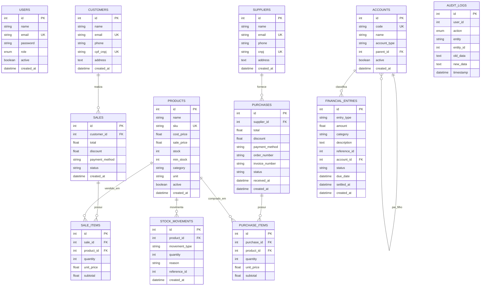

# Diagrama Entidade-Relacionamento

```mermaid
erDiagram
    USERS {
        int id PK
        string name
        string email UK
        string password
        enum role
        boolean active
        datetime created_at
    }

    CUSTOMERS {
        int id PK
        string name
        string email UK
        string phone
        string cpf_cnpj UK
        text address
        datetime created_at
    }

    SUPPLIERS {
        int id PK
        string name
        string email UK
        string phone
        string cnpj UK
        text address
        datetime created_at
    }

    PRODUCTS {
        int id PK
        string name
        string sku UK
        float cost_price
        float sale_price
        int stock
        int min_stock
        string category
        string unit
        boolean active
        datetime created_at
    }

    SALES {
        int id PK
        int customer_id FK
        float total
        float discount
        string payment_method
        string status
        datetime created_at
    }

    SALE_ITEMS {
        int id PK
        int sale_id FK
        int product_id FK
        int quantity
        float unit_price
        float subtotal
    }

    PURCHASES {
        int id PK
        int supplier_id FK
        float total
        float discount
        string payment_method
        string order_number
        string invoice_number
        string status
        datetime received_at
        datetime created_at
    }

    PURCHASE_ITEMS {
        int id PK
        int purchase_id FK
        int product_id FK
        int quantity
        float unit_price
        float subtotal
    }

    STOCK_MOVEMENTS {
        int id PK
        int product_id FK
        string movement_type
        int quantity
        string reason
        int reference_id
        datetime created_at
    }

    FINANCIAL_ENTRIES {
        int id PK
        string entry_type
        float amount
        string category
        text description
        int reference_id
        int account_id FK
        string status
        datetime due_date
        datetime settled_at
        datetime created_at
    }

    ACCOUNTS {
        int id PK
        string code UK
        string name
        string account_type
        int parent_id FK
        boolean active
        datetime created_at
    }

    AUDIT_LOGS {
        int id PK
        int user_id
        enum action
        string entity
        int entity_id
        text old_data
        text new_data
        datetime timestamp
    }

    CUSTOMERS ||--o{ SALES : realiza
    SALES ||--o{ SALE_ITEMS : possui
    PRODUCTS ||--o{ SALE_ITEMS : vendido_em
    SUPPLIERS ||--o{ PURCHASES : fornece
    PURCHASES ||--o{ PURCHASE_ITEMS : possui
    PRODUCTS ||--o{ PURCHASE_ITEMS : comprado_em
    PRODUCTS ||--o{ STOCK_MOVEMENTS : movimenta
    ACCOUNTS ||--o{ FINANCIAL_ENTRIES : classifica
    ACCOUNTS ||--o{ ACCOUNTS : pai_filho
```
